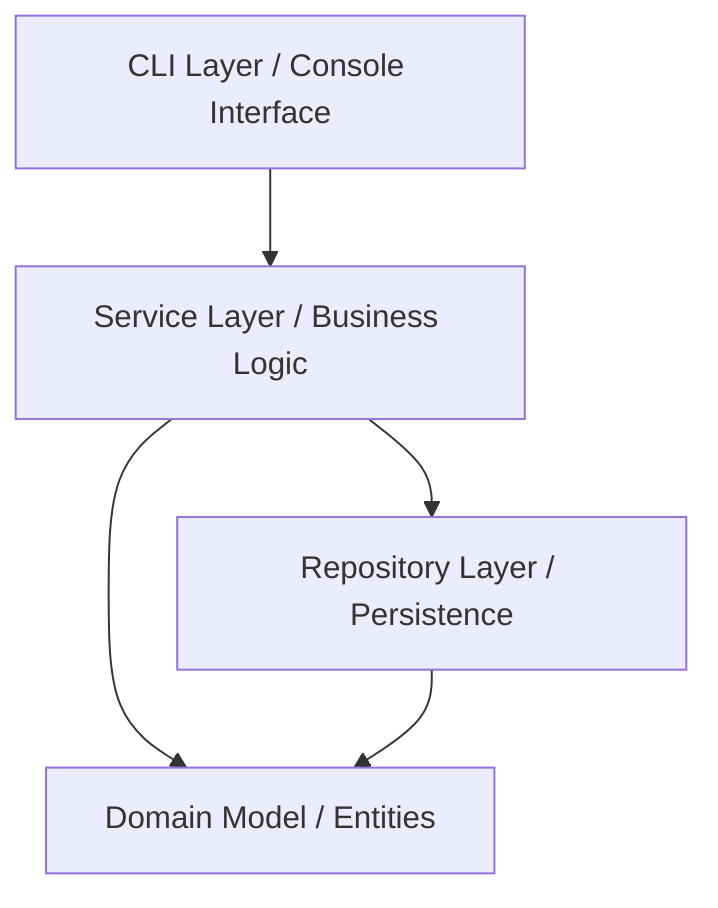

# ElectroShop - E-commerce System

## Project Status
The project is currently under active development.

## 1. Introduction
This is an e-commerce backend built with Java 17. 

Rather than just being a simple store, this project was designed as a practical playground to understand object-oriented design, data persistence, and most importantly, concurrency. It demonstrates how to build a scalable and thread-safe application from the ground up, without relying on heavy frameworks. 

*Note: Following the project guidelines, the Command Line Interface (CLI) is intentionally kept as a simple wrapper. The primary focus of this application is the robust backend architecture and business logic.*

---

## 2. Dependencies & Architecture

The project relies on Maven and keeps external dependencies to an absolute minimum to focus on core Java capabilities.

### Technologies
* **Java 17:** Core language features (Records, Switch Expressions).
* **Lombok:** Reduces boilerplate code.
* **SLF4J:** Standard logging facade for tracking application flow.
* **JUnit 5 & AssertJ:** Frameworks for readable and reliable unit/integration testing.
* **Mockito:** Mocking framework to isolate unit tests.

### Architecture Overview
The application follows a clean, layered architecture to separate concerns:



* **Service Layer:** Acts as the orchestrator. Services (like `CartService`, `OrderProcessor`, `ProductManager`) do not hold state. They coordinate interactions between domain objects and repositories, ensuring that business rules (like checking stock before placing an order) are strictly followed.

---

## 3. Package Structure

To maintain a clean separation of concerns, the project is organized into well-defined packages:

```text
pl.adrian.electroshop
├── cli                  # Command Line Interface (User & Employee menus)
├── exception            # Custom business and technical exceptions
├── model                # Domain entities (Core business objects)
│   ├── cart             # Shopping cart and cart items
│   ├── customer         # Customer data
│   ├── invoice          # Invoice representation
│   ├── order            # Orders, order lines, statuses, and immutable snapshots
│   └── product          # Products, CartItem, and polymorphic configurations
├── repository           # Persistence layer (Interfaces)
│   ├── file             # File-based implementations and serialization logic
│   └── inmemory         # Thread-safe in-memory implementations (ConcurrentHashMap)
└── service              # Core business logic and orchestration
    ├── concurrency      # Thread-safety utilities, fine-grained locks, batch processing
    └── invoice          # Thread-safe invoice number generation strategies
```

---

## 4. High-Level Domain Overview

To keep the business logic clean, the domain model is strictly separated from technical and infrastructure concerns. 

* **Products (Polymorphic Design):** I use an abstract `Product` class extended by specific types: `Computer`, `Smartphone`, and `Electronics`. 
* **Cart (`Cart`):** Manages `CartItem`s before checkout. It intelligently merges identical products with the exact same configuration while treating different configurations of the same product as separate items.
* **Order (`Order`):** Represents a finalized purchase. It takes an immutable snapshot (`OrderLine`) of the cart items at the moment of purchase, ensuring historical data remains accurate even if product prices change later.
* **Invoice (`Invoice`):** Automatically generated upon successful order placement.
* **Customer (`Customer`):** Holds the buyer's details.

---

## 5. Architectural Decisions & Encapsulation

As a beginner, it is easy to write code that works for a single user. This project is built to handle *many* concurrent users safely. Here is the reasoning behind key technical decisions:

### Strict Encapsulation (The `CartItem` creation)
* **What:** A `CartItem` resides in the `product` package and can *only* be instantiated via the `Product.toCartItem(configuration, quantity)` method.
* **Why:** This guarantees that a `CartItem` can never exist in an invalid state. The product itself acts as a factory, verifying its own stock and validating the requested configuration before allowing the item to enter the cart.

### Two Persistence Modes (Interfaces over Implementation)
* **What:** The system supports both `In-Memory` (using `ConcurrentHashMap`) and `File-Based` (custom Key-Value format) storage.
* **Why:** By defining repository interfaces (e.g., `OrderRepository`), the `Service` layer does not care *how* data is saved (Dependency Inversion Principle).

### Concurrency Safety (`ProductLockRegistry`)
* **What:** When a user buys a product, we need to lock the inventory so two people do not buy the last item simultaneously.
* **Why:** Instead of locking the *entire* warehouse, I implemented a `ProductLockRegistry`. This provides **fine-grained locks** based on the specific `productId`, preventing race conditions while allowing maximum concurrent throughput.

### Immutability & Reference Safety
* **What:** Strict enforcement of object immutability and defensive copying, especially for collections and historical data.
* **Why:** In Java, working directly on object references can create dangerous loopholes. If an `Order` kept a direct reference to a `CartItem`, modifying the cart later would retroactively alter the already completed order's price or quantity. To prevent this, the application heavily relies on defensive copying (mapping a `CartItem` to a frozen `OrderLine`), immutable records (like `OrderSnapshot`), and returning `List.copyOf()` from getters.

### Transactional Consistency (Saga Pattern / `CompensatingAction`)
* **What:** If an order contains 3 items, and the system successfully reserves the first 2 but fails on the 3rd, it must undo the first 2 reservations.
* **Why:** Without a database transaction manager, we built a custom `CompensatingAction` utility that executes rollback logic for only the items that were successfully processed.

### Testability and Time Handling (`java.time.Clock`)
* **Why:** By injecting a `java.time.Clock` into time-dependent services, we can use `Clock.fixed()` in our unit tests, guaranteeing predictable, reproducible tests every single time.

---

## 6. Asynchronous Processing & Multi-threading

The `OrderBatchProcessor` demonstrates different ways to handle bulk operations:

1. **Sequential:** Safe and predictable, but slow for large batches.
2. **Concurrent:** Uses an `ExecutorService` (Thread Pool). Multiple threads process orders at the same time, but the main thread blocks and waits for all to finish.
3. **Asynchronous (`processAsync`):** Uses `CompletableFuture.allOf`. A non-blocking approach that returns immediately.

**Generating Unique Invoice Numbers Under Load:** The `SequentialInvoiceNumberGenerator` uses a `ConcurrentHashMap` to separate counters by year and month, and an `AtomicInteger` for the actual sequence, avoiding slow, global `synchronized` blocks.

---

## 7. Testing Coverage

The project is highly test-driven, using **JUnit 5**, **Mockito**, and **AssertJ**.
Test coverage includes:
* **Domain Model Validation:** Ensuring products correctly validate configurations and cart logic merges items accurately.
* **Concurrency Testing:** Simulating high-load multi-threaded environments (e.g., `ProductManagerConcurrencyTest`, `SequentialInvoiceNumberGeneratorTest`) to ensure race conditions do not lead to overselling or duplicate invoice numbers.
* **Serialization/Deserialization:** Validating custom file repositories and edge cases (e.g., missing keys, corrupted data).
* **Exception Handling:** Verifying that custom exceptions (`InsufficientStockException`, `InvalidOrderStatusTransitionException`) are thrown precisely when expected.

---

## 8. Reflections & Future Improvements

Building this project surfaced several valuable learning points and trade-offs:

* **Product Configuration & `instanceof`:** The `ProductConfiguration` interface was introduced to handle diverse product specs (like RAM for computers vs. battery for smartphones). While functional, it occasionally forces `instanceof` checks during validation. In a future iteration, this could be refactored using the Visitor pattern or a more generic composition approach.
* **Domain Simplifications:** Classes like `Customer` and `Invoice` are simplified for the scope of this exercise. Real-world enhancements would include email validation, security/authentication, and dynamic tax calculations on invoices.
* **CLI as a Wrapper:** Following the instructor's advice, the CLI is intentionally basic to keep the focus entirely on the backend architecture and concurrency features.

---

## 9. Branching Strategy

To maintain clean code and a stable project history, the development follows a standard GitHub Flow structure:
- `master` – stable, production-ready code.
- `dev` – active development branch.
- `feature/TASK-*` – branches for developing new features.
- `fix/TASK-*` – branches for fixing issues.

---

## 10. How to Run

### Requirements
- Java 17
- Maven 3.6+

### Build the project
```bash
mvn clean package
```

### Run the tests
```bash
mvn test
```

### Run the application
Run the `Main.main()` method from your IDE, or execute it via the command line:

```bash
mvn exec:java -Dexec.mainClass="pl.adrian.electroshop.cli.Main"
```
*Follow the on-screen CLI prompts to switch between the Customer and Employee menus.*

---

## 11. Author

**Created by:** Adrian
